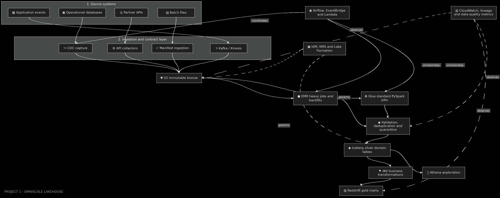

# Retail Lakehouse Data Platform

[](https://github.com/bhuvaneshwaranmurugan21/retail-lakehouse-data-platform/actions/workflows/ci.yml)
[](https://www.python.org/)
[](https://spark.apache.org/)
[](https://aws.amazon.com/)

I built this metadata-driven lakehouse to process retail orders, payments, inventory,
shipments and returns through one governed data path. The implementation combines
versioned source contracts, PySpark transformations, row-level quarantine, idempotent
Iceberg merges, Airflow orchestration and dbt/Redshift marts.

## Production workload

| Characteristic | Design point |
| --- | ---: |
| Daily ingestion | 1 TB+ |
| Business transactions | 10M+ per day |
| Logical event sources | 50+ |
| Core data domains | 5 |
| Availability SLO | 99.9% |
| Ingestion modes | Streaming, CDC and batch |

The repository contains five representative source contracts. New sources use the same
contract and pipeline interfaces instead of creating separate ETL codebases.

## Architecture



1. Kinesis accepts operational events while manifest-controlled files land in S3.
2. Every payload is persisted to immutable bronze storage before business validation.
3. Glue/PySpark applies explicit schemas, privacy rules, quality checks and deduplication.
4. Valid records are merged into Iceberg silver tables; invalid records retain their error
   context in quarantine.
5. dbt publishes tested Redshift marts for sales, fulfillment and inventory analytics.
6. Airflow coordinates dependencies and backfills; CloudWatch and Lake Formation provide
   operational visibility and access control.

## My contribution

- Designed the metadata-driven contract and onboarding model.
- Implemented the reusable PySpark bronze-to-silver pipeline.
- Added deterministic validation, PII hashing, quarantine and batch reconciliation.
- Implemented event-level idempotency through sequence-aware Iceberg `MERGE` statements.
- Built Airflow orchestration, dbt marts, Terraform infrastructure and CI checks.
- Defined the operational metrics, alert thresholds, replay procedure and backfill controls.

## Correctness guarantees

```text
input_rows = published_rows + duplicate_rows + quarantined_rows
```

- An event identifier produces at most one current silver record.
- Older retries cannot overwrite a newer arrival.
- Invalid rows are quarantined with explicit rule failures; they are never silently dropped.
- Contract identity fields cannot be nullable.
- PII transformations run before silver publication.
- Source schemas are explicit and versioned; production ingestion never relies on inference.

## Repository map

```text
config/contracts/          Versioned schemas, quality rules and privacy actions
src/retail_lakehouse/      Reusable contract, quality, merge and pipeline components
spark_jobs/                Glue-compatible bronze-to-silver entry point
orchestration/             Airflow DAG for daily processing and backfills
dbt/                       Redshift staging models, marts and tests
infrastructure/terraform/  S3, Kinesis, Glue, Lake Formation, KMS and monitoring
infrastructure/sql/        Iceberg silver table definitions
tests/                     Unit and local Spark integration tests
docs/                      Architecture, contracts, operations, performance and ADRs
```

## Run locally

Requirements: Python 3.11+, Java 17 and approximately 2 GB of free memory.

```bash
python -m venv .venv
source .venv/bin/activate
python -m pip install -e ".[spark,dev]"

make validate-contracts
make lint
make test

SPARK_LOCAL_IP=127.0.0.1 python spark_jobs/bronze_to_silver.py \
  --contract config/contracts/orders_v1.yaml \
  --input examples/orders.jsonl \
  --silver-path data/silver/orders \
  --quarantine data/quarantine/orders
```

The sample batch produces this reconciliation result:

```json
{"dataset":"orders","input_rows":4,"published_rows":2,"duplicate_rows":1,"quarantined_rows":1,"reconciled":true,"valid_rows_before_deduplication":3}
```

## Technical documentation

- [Architecture](docs/architecture.md)
- [Source contracts](docs/data-contracts.md)
- [Operations runbook](docs/operations.md)
- [Performance and capacity](docs/performance.md)
- [Architecture decisions](docs/decisions/)

All fixtures are synthetic. The repository contains no client data, credentials or
proprietary source code.
